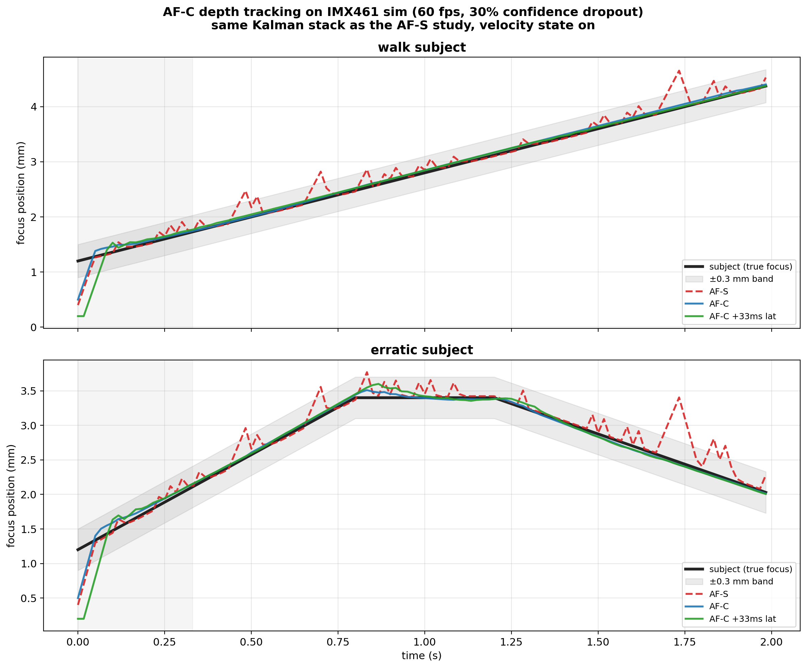
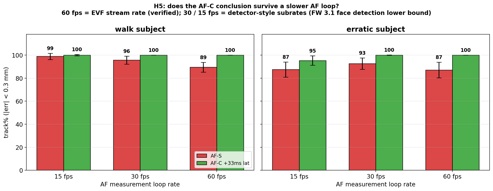

# x2d-pdaf-sim

An open simulation testbench for phase-detection autofocus (PDAF)
decision policies on mirrorless cameras, with the Hasselblad X2D 100C
(firmware 4.2.0) as the running case study.

The headline question:

> Given identical PDAF hardware, how much of an AF body's hunting
> behaviour is determined by the firmware decision policy that consumes
> the PDAF output?

## Headline result


The experiment simulates the X2D's actual sensor geometry — Sony
IMX461, 294 PDAF zones (21 × 14) tiled across the active area, each
zone phase-correlated at the native 3.76 µm pitch — and stacks
firmware-level changes one lever at a time:

- **A. baseline** — stateless single-frame PSR threshold, 15 fps AF
  loop, single zone (a fair monotonic-scan CDAF fallback, not a
  strawman)
- **B. + binned AF readout** — same stateless policy at 60 fps
- **C. + Kalman temporal prior** — confidence-weighted measurement
  fusion across frames
- **D. + multi-zone aggregation** — nearest-5 zones,
  confidence-weighted, agreement-damped
- **E. + deadband / PID / CDAF fusion** — mechanical-smoothness stack
  (currently mistuned for multi-zone inputs; kept for transparency)
- **F. = D + 2-frame ISP latency with timestamp-correct measurement
  association** — demonstrates that pipeline latency is handled by
  standard predictive-AF bookkeeping, not a blocker

Run on 1000 independent seeds per configuration per scene; figures
report mean ± std. The simulation includes lens motor rate limiting
(no teleporting lens) and a fixed scene per trial (measurement errors
are *not* i.i.d. across frames, so the temporal prior is not given an
unrealistic advantage).

Numbers, tables and the full argument live in
[TECHNICAL_PROPOSAL.md](TECHNICAL_PROPOSAL.md).

## Continuous AF (AF-C): the same stack tracks a moving subject

The AF-S study above asks "can the lens converge on a stationary
subject without hunting?" The follow-up asks the harder question —
the one usually answered with "the hardware can't": can the **same
decision stack** track a subject that is *moving* in depth?

It can, because the Kalman state already contains a velocity term —
and a velocity estimate *is* the core of predictive continuous AF.
No new machinery was added; the existing AF-S stack was pointed at
moving subjects.



A walking subject (constant velocity) and an erratic one (approach,
hard stop, reverse — the worst case for a velocity prior), both with
30 % intermittent confidence dropout, the regime where the stateless
policy hunts:

| 60 fps loop | track % (±0.3 mm) | worst error | hunts / 2 s |
|---|---|---|---|
| stateless (AF-S policy) | 87–90 % | 0.65–0.83 mm | **~36** |
| Kalman velocity prior (AF-C) | **100 %** | 0.05–0.10 mm | **0** |
| AF-C + 33 ms pipeline latency | **100 %** | 0.05–0.17 mm | **0** |

Three hardening passes matter as much as the headline (all documented
in `DEV_LOG.md`, including the flawed first version):

- **Dropout grid, not a chosen point** — the AF-C advantage is mapped
  across the full dropout-probability × confidence plane, *including
  the regions where it vanishes* (`out/afc_dropout_grid.png`). The
  mechanism's predicted boundaries match the measured ones.
- **Burst blackout** — periodic PDAF-blind windows at a ~3.3 fps burst
  cadence. The stateless policy can only hold through a gap; the
  Kalman coasts on velocity and bridges every one
  (`out/afc_burst.png`).
- **The AF-loop-rate assumption is removed entirely:**



The only externally verifiable facts are that the EVF stream runs at
60 fps and that firmware 3.1.0 added face detection — proof of *some*
continuous per-frame computation, at an unpublished rate. So instead
of assuming 60 fps, the experiment sweeps the AF loop at 15 / 30 /
60 fps. The AF-C conclusion survives at every rate — at the most
conservative reading (15 fps detector-style subrate), it still tracks
a walking subject at ~100 % and an erratic one at 95 %, with zero
hunts. Two honest surprises are recorded in the dev log: the
stateless policy actually hunts *less* at slower loop rates (hunting
is a per-measurement pathology — so a slow loop cannot explain the
hunting away), and the erratic/15 fps cell is the genuine boundary of
the constant-velocity prior (95.3 %, worst error 0.32 mm).

**Scope, honestly:** this demonstrates the *depth-tracking* half of
AF-C. The lateral half — subject recognition and zone hand-off as the
subject moves across the frame — needs a subject-detection model and
is deliberately out of scope (that is legitimately X2D II territory).
And whether the X2D's ISP scheduler grants the AF loop a guaranteed
time slot is only measurable inside the camera. What the simulation
rules out is the *algorithm* and the *arithmetic*: an ISP budget
estimate in [FINDINGS.md](FINDINGS.md) shows the AF-C decision stack
adds ~2 MB/s and microseconds of compute per frame to a camera that
already streams ~480 MB/s to the EVF and runs face detection.

## What's in this repo

- `pdaf_sim/psf.py` — circle-of-confusion radius, half-disk sub-aperture
  PSFs, signed disparity prediction
- `pdaf_sim/dualpixel.py` — synthesize left/right PDAF views from a sharp
  image, with optional sensor binning and reproducible noise
- `pdaf_sim/phase_corr.py` — 1-D phase correlation with sub-pixel
  refinement, PSR confidence, multi-zone agreement, CDAF score
- `pdaf_sim/policy.py` — Stateless / Temporal (Kalman) / V3
  (deadband + PID + CDAF fusion) / Behavioral (fittable) policies
- `pdaf_sim/policy2d.py` — V4: 2-D zone grid + subject bounding-box
  Kalman tracker (subject persistence across occlusion)
- `pdaf_sim/sensor_imx461.py` — IMX461 geometry: 294-zone grid,
  native PDAF pitch, zone selection helpers
- `pdaf_sim/latency.py` — ISP pipeline-latency buffer
- `pdaf_sim/benchmarks.py` — standardized AF benchmarks with
  `REAL_ANCHORS` (direct observations of X2D 100C and Sony A7 IV)
- `scripts/run_imx461_stats.py` — **the headline experiment** (1000
  seeds, lever-by-lever, IMX461 geometry)
- `scripts/run_afc.py` — **the AF-C study**: moving-subject depth
  tracking, dropout grid, burst blackout, AF-loop-rate sweep
- `scripts/run_latency_sweep.py` — sensitivity of config D to
  uncompensated ISP latency
- `scripts/run_v4_tracking.py` — moving subject + occlusion demo
- `scripts/fit_policy.py` — behavioural-cloning fit of policy
  parameters to observed lens trajectories (differential evolution)
- `FINDINGS.md` — direct behavioural observations of the X2D 100C,
  organized by causal layer, cross-referenced with reviews and patents
- `DEV_LOG.md` — development log capturing intermediate hypotheses,
  failed configurations, and reasoning along the way
- `TECHNICAL_PROPOSAL.md` — the technical proposal this study supports,
  also intended for delivery as personal correspondence to Hasselblad

Earlier iterations (single-strip optics, superseded figures) are
preserved under `scripts/archive/` and `out/archive/` — the DEV_LOG
explains why each was superseded.

## Run

```bash
pip install -r requirements.txt
python scripts/run_imx461_stats.py     # headline figure (multi-core, ~2 min)
python scripts/run_afc.py              # AF-C study, all four figures (~1.5 min)
python scripts/run_latency_sweep.py    # latency sensitivity figure
```

## Case study constants

X2D-100C-class: Sony IMX461 (43.8 × 32.9 mm, 11656 × 8750, 3.76 µm),
294 PDAF zones, XCD 2,5/55V at f/2.5, 1.5 m subject. Swap the
constants in `pdaf_sim/sensor_imx461.py` to model another body.

## Real-camera anchors

The simulation is anchored against direct observations of:

- Hasselblad X2D 100C (firmware 4.2.0) with XCD 2,5/55V
- Sony A7 IV with 50mm f/1.8

Observed hunt times, failure indicators and behaviour signatures live
in `pdaf_sim/benchmarks.py::REAL_ANCHORS` and `FINDINGS.md`. The
baseline's stochastic same-scene behaviour in simulation independently
reproduces the stochastic lock-vs-hunt behaviour observed on the real
X2D — the one place where the synthetic model and the physical camera
cross-validate.

## What this is NOT

- Not a claim about Hasselblad's internal firmware implementation.
  Decision policies are generic and based on public PDAF literature;
  X2D constants are used only to make disparity magnitudes realistic.
  The firmware is closed: observed behaviour is consistent both with
  these techniques being absent and with them being present but
  limited elsewhere.
- Not a reverse-engineered firmware patch. The X2D firmware is signed
  and is not modified here. This is a behavioural / decision-policy
  study built entirely from public information and direct external
  observation.
- Not a deep-learning method. A linear Kalman prior is the minimum
  thing that should outperform a stateless threshold; if it does,
  more sophisticated approaches become worth exploring.

## Citations and further reading

- USPTO 9910247 — Focus hunting prevention for phase detection autofocus
- USPTO 9729779 — Phase detection autofocus noise reduction
- USPTO 11523071 — Disparity-preserving binning for phase detection
  autofocus (evidence that naive binning destroys PDAF phase signal)
- *Improving the Reliability of Phase Detection Autofocus* (IS&T)
- Sony Semiconductor IMX461 product flyer (binning modes documented
  for moving-picture output; PDAF-in-binned-mode behaviour not public)
- Capture Integration — *Fujifilm GFX 100S II — Profoundly Better
  Autofocus* (algorithmic-only PDAF improvement across two generations
  with shared hardware)

## License

MIT.

## Acknowledgements

Built in conversation with Claude (Anthropic) as a thinking partner,
in the spirit of "a smart colleague who walks into the room." Final
technical claims and observations are the author's responsibility.
