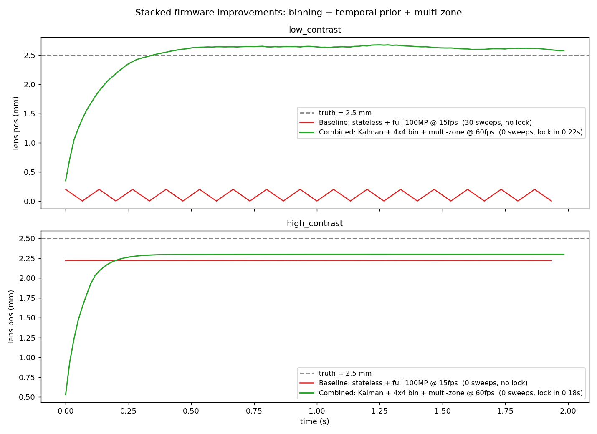

# x2d-pdaf-sim

An open simulation testbench for phase-detection autofocus (PDAF)
decision policies on mirrorless cameras, with the Hasselblad X2D 100C
(firmware 4.2.0) as the running case study.

The headline question:

> Given identical PDAF hardware, how much of an AF body's hunting
> behaviour is determined by the firmware decision policy that consumes
> the PDAF output?

## Headline result



Red = X2D-like baseline (stateless single-frame threshold, full 100MP
readout, ~15 fps AF). Green = the same simulated optics with three
firmware-level changes stacked:

1. AF-readout binning 4x4 during half-press (15 fps → 60 fps)
2. Kalman temporal prior with confidence-weighted measurement variance
3. Multi-zone PDAF confidence agreement

On a low-contrast subject, the baseline never reaches focus (30 sweep
events in 2 s). The combined policy locks in 0.22 s with zero sweeps.
None of the three levers requires hardware changes.

## What's in this repo

- `pdaf_sim/psf.py` — circle-of-confusion radius, half-disk sub-aperture
  PSFs, signed disparity prediction
- `pdaf_sim/dualpixel.py` — synthesize left/right PDAF views from a sharp
  image, with optional sensor binning
- `pdaf_sim/phase_corr.py` — 1-D phase correlation with sub-pixel
  refinement, PSR confidence, and multi-zone agreement variant
- `pdaf_sim/policy.py` — Stateless / Temporal / Composite / Behavioral
  policies (the last is parameterized and designed to be FIT to real
  observed camera behaviour)
- `pdaf_sim/benchmarks.py` — six standardized AF benchmarks (T1-T6),
  reproducible on a real camera, with `REAL_ANCHORS` for direct
  observation data
- `pdaf_sim/runner.py` — single entry point for "run policy P on
  benchmark B"
- `pdaf_sim/scene.py` — synthetic high-contrast, low-contrast,
  repeating-pattern strips
- `scripts/run_experiment.py` — Stateless vs Temporal v1 baseline figure
- `scripts/run_v2_comparison.py` — three policies on all six benchmarks
- `scripts/run_binning_sweep.py` — AF framerate sweep via sensor binning
- `scripts/run_stacked_experiment.py` — the headline figure above
- `scripts/fit_policy.py` — fit BehavioralPolicy parameters to
  observed-behaviour trajectories via differential evolution
- `FINDINGS.md` — direct behavioural observations of the X2D 100C,
  organized by causal layer, cross-referenced with reviews and patents
- `DEV_LOG.md` — development log capturing intermediate hypotheses,
  failed configurations, and reasoning along the way
- `TECHNICAL_PROPOSAL.md` — the technical proposal this study supports,
  also intended for delivery as personal correspondence to Hasselblad

## Run

```bash
pip install -r requirements.txt
python scripts/run_stacked_experiment.py   # produces the headline figure
```

## Case study optics

Defaults are X2D-100C-class: 43.8x32.9 BSI sensor, ~3.76um pitch,
XCD 2,5/55V at f/2.5 on a 1.5 m subject. Swap the constants in any
script to model another body.

## Real-camera anchors

The simulation is anchored against direct observations of:

- Hasselblad X2D 100C (firmware 4.2.0) with XCD 2,5/55V
- Sony A7 IV with 50mm f/1.8

The user observations (hunt times, failure indicators, behaviour
signatures) live in `pdaf_sim/benchmarks.py::REAL_ANCHORS` and
`FINDINGS.md`. As more measurements arrive, they replace synthetic
stand-ins in the fitting pipeline.

## What this is NOT

- Not a claim about Hasselblad's internal firmware implementation.
  Decision policies are generic and based on public PDAF literature;
  X2D constants are used only to make disparity magnitudes realistic.
- Not a reverse-engineered firmware patch. The X2D firmware is signed
  and is not modified here. This is a behavioural / decision-policy
  study built entirely from public information and direct external
  observation.
- Not a deep-learning method. A linear Kalman prior is the minimum
  thing that should outperform a stateless threshold; if it does,
  more sophisticated approaches (learned confidence calibration,
  scene-conditioned priors) become worth exploring.

## Citations and further reading

- USPTO 9910247 — Focus hunting prevention for phase detection autofocus
- USPTO 9729779 — Phase detection autofocus noise reduction
- *Improving the Reliability of Phase Detection Autofocus* (IS&T)
- Capture Integration — *Fujifilm GFX 100S II — Profoundly Better
  Autofocus* (algorithmic-only PDAF improvement across two generations
  with shared hardware)

## License

MIT.

## Acknowledgements

Built in conversation with Claude (Anthropic) as a thinking partner,
in the spirit of "a smart colleague who walks into the room." Final
technical claims and observations are the author's responsibility.
