# x2d-pdaf-sim

An open simulation testbench for phase-detection autofocus (PDAF)
decision policies on mirrorless cameras, with the Hasselblad X2D 100C
(firmware 4.2.0) as the running case study.

The headline question:

> Given identical PDAF hardware, how much of an AF body's hunting
> behaviour is determined by the firmware decision policy that consumes
> the PDAF output?

## Headline result

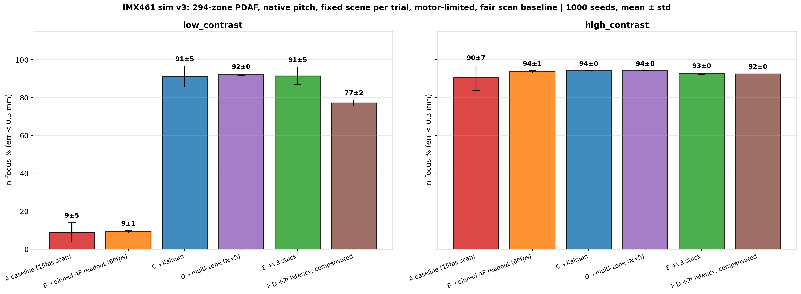

The experiment simulates the X2D's actual sensor geometry — Sony
IMX461, 294 PDAF zones (21 × 14) tiled across the active area, each
zone phase-correlated at the native 3.76 µm pitch — and stacks
firmware-level changes one lever at a time:

- **A. baseline** — stateless single-frame PSR threshold, 15 fps AF
  loop, single zone (a fair monotonic-scan CDAF fallback, not a
  strawman)
- **B. + binned AF readout** — same stateless policy at 60 fps
- **C. + Kalman temporal prior** — confidence-weighted measurement
  fusion across frames
- **D. + multi-zone aggregation** — nearest-5 zones,
  confidence-weighted, agreement-damped
- **E. + deadband / PID / CDAF fusion** — mechanical-smoothness stack
  (currently mistuned for multi-zone inputs; kept for transparency)
- **F. = D + 2-frame ISP latency with timestamp-correct measurement
  association** — demonstrates that pipeline latency is handled by
  standard predictive-AF bookkeeping, not a blocker

Run on 1000 independent seeds per configuration per scene; figures
report mean ± std. The lens is modelled as a servo-controlled magnetic
voice-coil motor (critically damped, velocity-capped at the speed
setting, acceleration-limited, no gear backlash — no teleporting lens),
and the scene is fixed per trial (measurement errors are *not* i.i.d.
across frames, so the temporal prior is not given an unrealistic
advantage). The PDAF/CDAF fusion is **confidence-gated**, not a fixed
weight ratio: PDAF leads, CDAF verifies near focus and backs off under
low confidence.

Numbers, tables and the full argument live in
[TECHNICAL_PROPOSAL.md](TECHNICAL_PROPOSAL.md).

## Continuous AF (AF-C): the same stack tracks a moving subject

The AF-S study above asks "can the lens converge on a stationary
subject without hunting?" The follow-up asks the harder question —
the one usually answered with "the hardware can't": can the **same
decision stack** track a subject that is *moving* in depth?

It can, because the Kalman state already contains a velocity term —
and a velocity estimate *is* the core of predictive continuous AF.
No new machinery was added; the existing AF-S stack was pointed at
moving subjects.

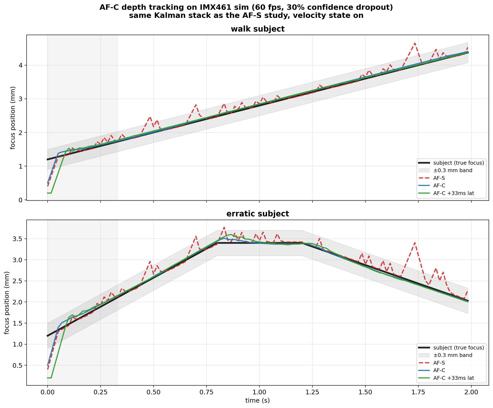

A walking subject (constant velocity) and an erratic one (approach,
hard stop, reverse — the worst case for a velocity prior), both with
30 % intermittent confidence dropout, the regime where the stateless
policy hunts:

| 60 fps loop | track % (±0.3 mm) | worst error | hunts / 2 s |
|---|---|---|---|
| stateless (AF-S policy) | 87–90 % | 0.65–0.83 mm | **~36** |
| Kalman velocity prior (AF-C) | **100 %** | 0.05–0.10 mm | **0** |
| AF-C + 33 ms pipeline latency | **100 %** | 0.05–0.17 mm | **0** |

Three hardening passes matter as much as the headline (all documented
in `DEV_LOG.md`, including the flawed first version):

- **Dropout grid, not a chosen point** — the AF-C advantage is mapped
  across the full dropout-probability × confidence plane, *including
  the regions where it vanishes* (`out/afc_dropout_grid.png`). The
  mechanism's predicted boundaries match the measured ones.
- **Burst blackout** — periodic PDAF-blind windows at a ~3.3 fps burst
  cadence. The stateless policy can only hold through a gap; the
  Kalman coasts on velocity and bridges every one
  (`out/afc_burst.png`).
- **The AF-loop-rate assumption is removed entirely:**

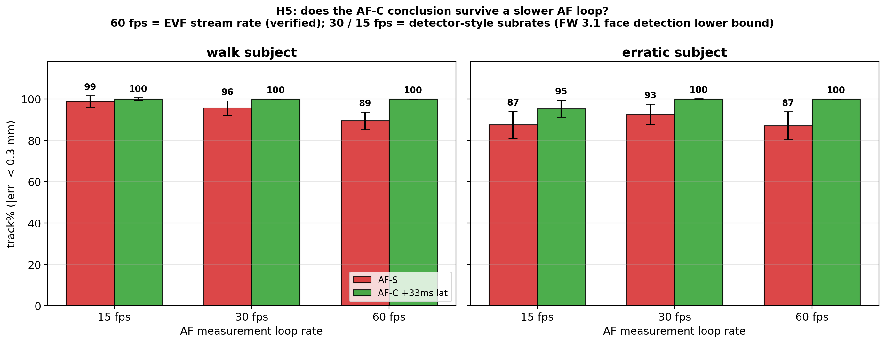

The only externally verifiable facts are that the EVF stream runs at
60 fps and that firmware 3.1.0 added face detection — proof of *some*
continuous per-frame computation, at an unpublished rate. So instead
of assuming 60 fps, the experiment sweeps the AF loop at 15 / 30 /
60 fps. The AF-C conclusion survives at every rate — at the most
conservative reading (15 fps detector-style subrate), it still tracks
a walking subject at ~100 % and an erratic one at 95 %, with zero
hunts. Two honest surprises are recorded in the dev log: the
stateless policy actually hunts *less* at slower loop rates (hunting
is a per-measurement pathology — so a slow loop cannot explain the
hunting away), and the erratic/15 fps cell is the genuine boundary of
the constant-velocity prior (95.3 %, worst error 0.32 mm).

**Scope, honestly:** this demonstrates the *depth-tracking* half of
AF-C. The lateral half — subject recognition and zone hand-off as the
subject moves across the frame — needs a subject-detection model and
is deliberately out of scope (that is legitimately X2D II territory).
And whether the X2D's ISP scheduler grants the AF loop a guaranteed
time slot is only measurable inside the camera. What the simulation
rules out is the *algorithm* and the *arithmetic*: an ISP budget
estimate in [FINDINGS.md](FINDINGS.md) shows the AF-C decision stack
adds ~2 MB/s and microseconds of compute per frame to a camera that
already streams ~480 MB/s to the EVF and runs face detection.

## Extended AF-C algorithm studies

Six additional simulation studies isolating *where* AF-C quality actually comes
from (simulation only — see [DISCLAIMER.md](DISCLAIMER.md)).

**Loop rate is the big lever; speed cap only helps big throws.** Sweeping AF loop
rate × lens speed cap, with a *servo-controlled magnetic voice-coil* lens model
(critically damped, velocity-capped, acceleration-limited, no backlash — an
XCD 55V-style linear motor). Speed caps are modelled at the real values:
4000 steps/s (X2D today), 10000 (proposed), 12000 (X2D II), 24000 (silicon
ceiling). For *normal* subject motion the loop rate dominates (≈7.5 Hz → 60 Hz:
65% → 99%) and the four speed caps essentially overlap — a faster motor adds
almost nothing once it already outruns the subject. Speed only pays off on a
*big rack focus* (0.6 m ↔ 8 m): settle time 4000 = 433 ms → 10000 = 233 ms →
12000 = 200 ms → 24000 = 150 ms. The temporal filter is a minor lever (≈+5):

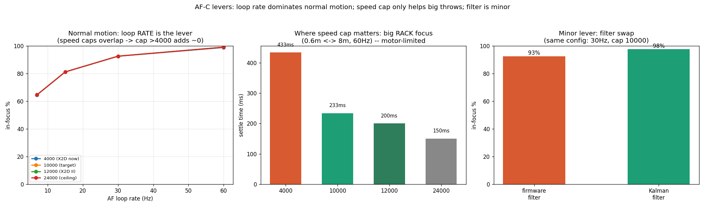

**Why AF-C stays laggy — timing.** Pipeline latency + loop rate vs a predictive
filter (a non-predictive smoother lags; prediction tuned to the latency recovers it):

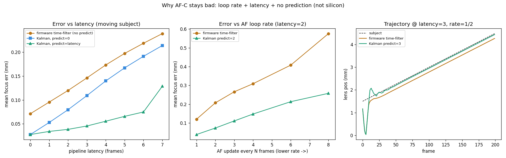

**Adaptive policy in realistic units (subject distance in metres), high vs low contrast:**

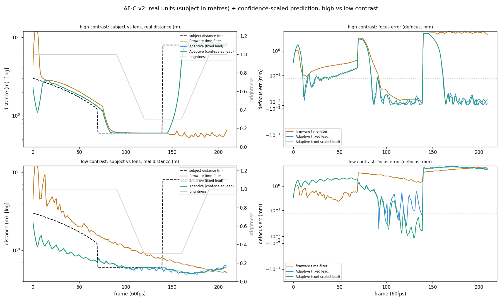

**Periodic patterns fool phase-detect (confident false lock); CDAF disambiguates:**

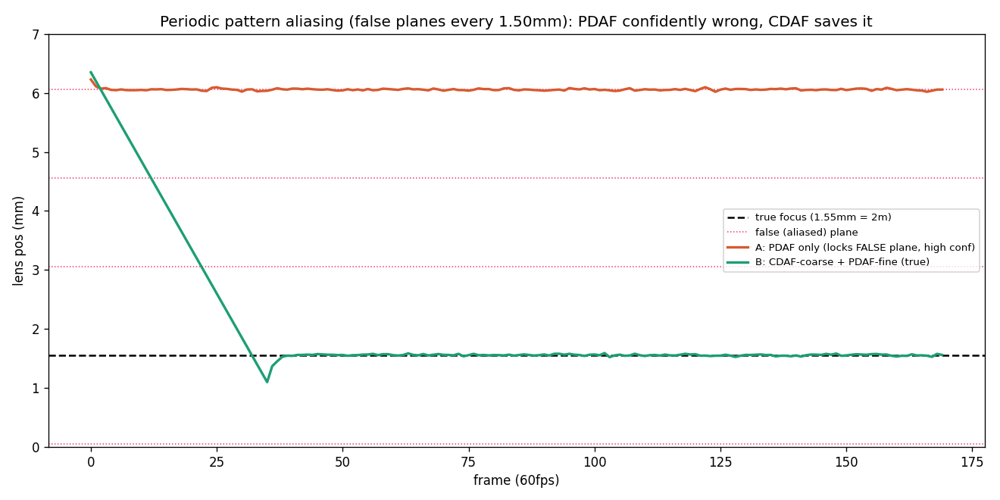

**Timing a front → background focus pull (prediction overshoots on sudden steps):**

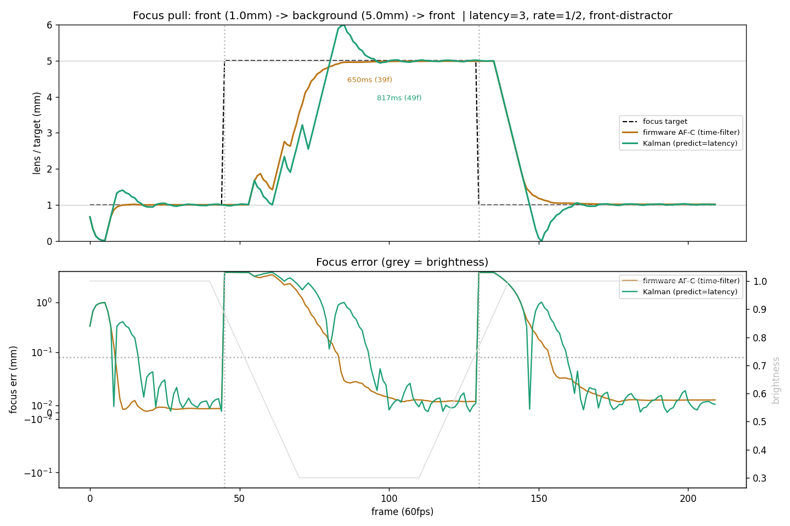

**Low contrast is measurement-limited — temporal integration recovers faint
texture without LiDAR; a textureless target is unfocusable by any passive method:**

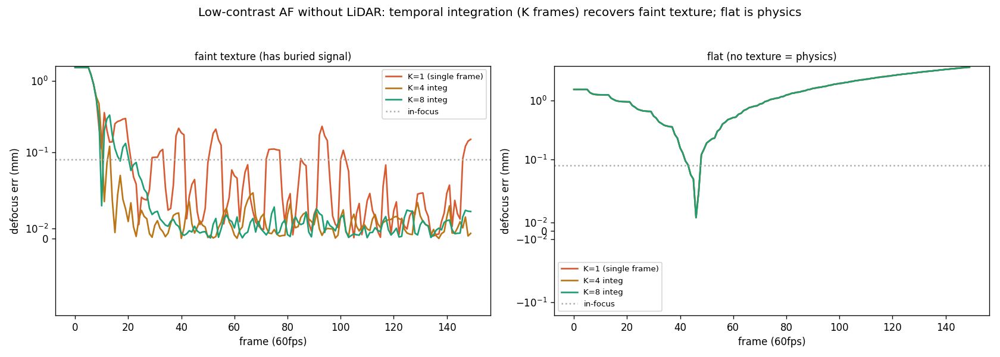

**Mixed / harsh-environment stress test (~2 minutes).** Brightness, motion type,
fog, and distortions (periodic aliasing / noise bursts / occlusion dropouts)
randomly combined per segment; an improved policy vs the baseline, with a
per-condition in-focus breakdown. Firmware (30 Hz, 4000) vs X2D+ (60 Hz, 10000):
56% → 68% overall. X2D+ wins where its mechanisms apply — erratic motion
(28 → 48%), periodic aliasing (38 → 52%), occlusion dropouts (42 → 66%) — and
ties where the baseline is already fine (static / steady / step / noise, all
≥ 95%). Single seed; see the multi-seed ablation below for error bars:

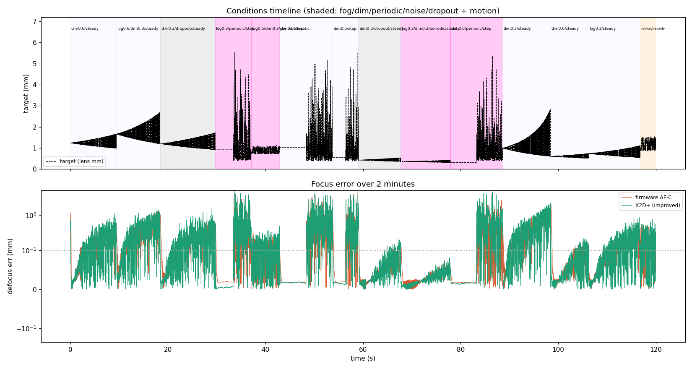

**Core AF-C job, normal conditions — moving subject + occlusion.** A brisk
walk-in with ~1 s occlusion dropouts, good light and contrast. Firmware runs on
X2D's current hardware (30 Hz, 4000 steps/s); the full proposal is 60 Hz at
10000 steps/s. The baseline freezes and *loses the focus zone* during occlusion
(≈45% in-focus there, 64% overall); a predictive filter on the *same* hardware
coasts through it (≈82% / 90%), and the full proposal holds the subject
(≈87% through occlusion, 94% overall):

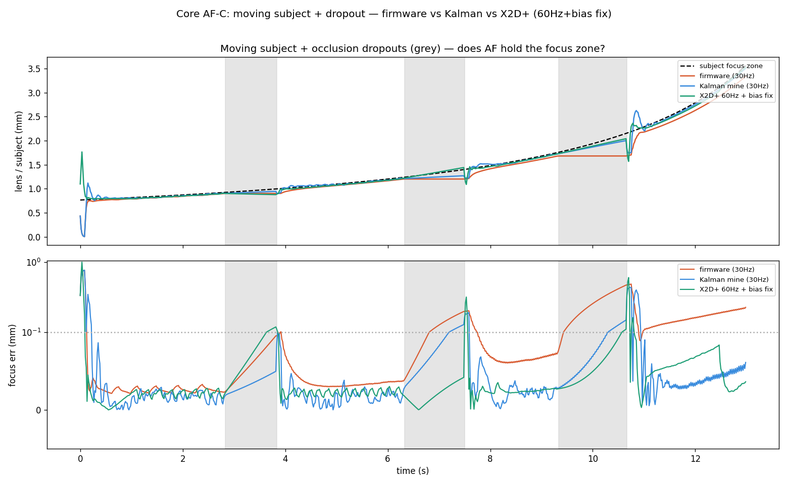

**Does raising the loop rate lift the *harsh* mix?** Yes. Re-running the
2-minute harsh timeline at 30 Hz vs 60 Hz: firmware 56% → 62%, X2D+ 51% → 68%.
The predictive policy *needs* the faster loop. At 30 Hz it is actually below
the baseline on this seed, because its velocity estimate is too stale to
extrapolate on. (An earlier version of this paragraph said the harsh mix was
"measurement-limited" and loop rate barely helped. That was an artefact of a
timeline bug that teleported the subject every frame; see `DEV_LOG.md`,
"Harsh-timeline teleport bug".)

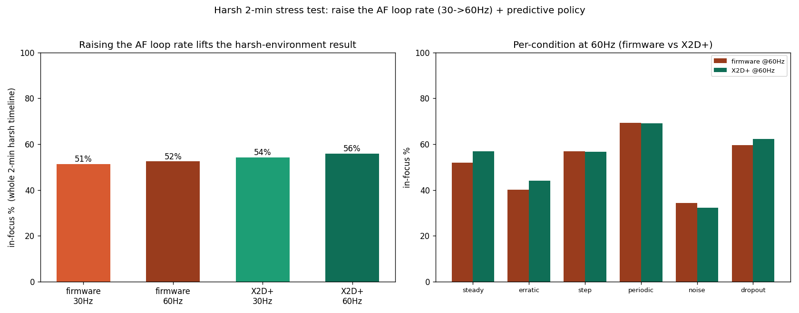

**Incremental ablation over a 4-phase timeline.** Adding one lever at a time
(loop rate → predictive policy → speed cap) over 2.5 minutes, with the realistic
servo magnetic motor:

- **P1 (30 s)**: high-contrast *random teleports* anywhere from 0.6 m to
  infinity (uniform in dioptres, random 1.5–3.5 s holds)
- **P2 (30 s)**: *1–2% contrast*
- **P3 (30 s)**: *occlusion*. The subject wanders in depth while textured
  foreground occluders cross in front of it, sometimes covering only some
  AF zones and sometimes all of them
- **P4 (60 s)**: the *harsh mix* plus *rain* on random segments

Occluders and rain are rendered as their own textured layers at their own
depth and composited into the AF zones they cover. Their PDAF confidence
comes out of the same optics + phase-correlation stack; nothing is
hand-coded as "no measurement".

**AF-C and AF-T have different correct answers under occlusion**, so each mode
is scored against its own:

- **AF-C** focuses on whatever is in the AF area. When an occluder fills most
  of it (more than half the zones, which is where the multi-zone median flips),
  focusing on the occluder *is* the right answer.
- **AF-T** knows which object is the subject. It should ignore the occluder
  and stay on the subject. It is modelled as X2D+ plus an ideal subject
  tracker: occluded AF zones are dropped from the PDAF measurement, and when
  every zone is covered the policy coasts on its velocity estimate. Ideal
  identity makes this an upper bound on what a real tracker achieves.

Mean ± std over 10 independent timelines, each config scored against its
own mode's target:

| config | P1 teleport | P2 low-con | P3 occlusion | P3 while occluder fills AF area | P4 harsh+rain | overall |
|---|---|---|---|---|---|---|
| firmware AF-C (30 Hz, 4000) | 88 ± 1% | 65 ± 15% | 85 ± 4% | 63 ± 8% | 68 ± 13% | 75 ± 7% |
| + loop rate (60 Hz) | 93 ± 1% | 78 ± 12% | 91 ± 3% | 77 ± 7% | 72 ± 12% | 81 ± 6% |
| + predictive (60 Hz, 4000) | 93 ± 1% | 88 ± 9% | 91 ± 3% | 78 ± 7% | 79 ± 9% | 86 ± 4% |
| + speed 10000 (= X2D+ AF-C) | 95 ± 1% | 88 ± 9% | 93 ± 2% | 84 ± 5% | 75 ± 12% | 85 ± 6% |
| **X2D+ AF-T** (subject tracker) | 95 ± 1% | 88 ± 9% | **99 ± 1%** | **95 ± 6%** | 76 ± 12% | **87 ± 6%** |

What each lever does:

- **Loop rate** is the broadest lever. It lifts every phase, and it is the
  biggest single gain for AF-C switching onto an occluder (63 → 77%).
- **Predictive** carries low contrast (+10) and the harsh mix (+7).
- **Speed cap** pays off wherever focus has to travel far and fast: the big
  random teleports (+2) and AF-C snapping onto a near occluder (78 → 84%).
  Everywhere else it is within noise.

AF-C and AF-T behave as each should. While an occluder fills the AF area, the
AF-C configs sit on the subject only 9–19% of the time, because they correctly
move to the occluder. AF-T sits on the occluder only 3% of the time and
holds the subject 95% of the time. Outside occlusion AF-T matches X2D+ AF-C,
so subject tracking costs nothing elsewhere. Rain frames alone: 73% → 78%
(firmware → X2D+).

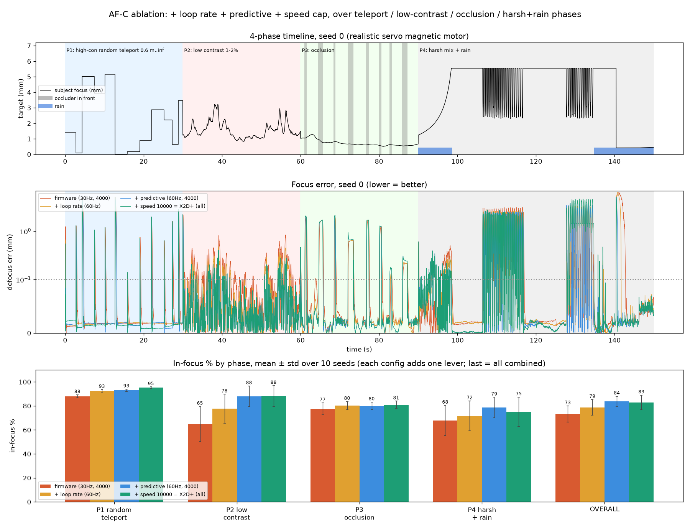

## DualGated: confidence-calibrated, two-timescale AF-C policy (+ C99 port)

How much of P2 (1–2% contrast) can better *confidence handling* recover? Not much, the
simulator says. And the policy that recovers most of it needs a second timescale to stay
safe under occlusion.

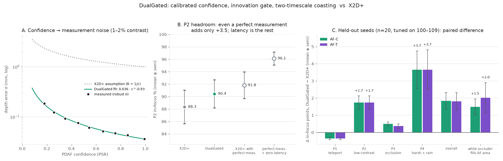

- **A. Calibrate confidence → noise.** On the simulator's own PDAF stack at P2 conditions,
  the depth error is σ(c) ≈ 0.036 · c^−0.93 mm. X2D+ assumes R = 1/c, i.e. σ of 1–2.4 mm,
  about 30× too wide at high confidence. In every lighting condition tested there were no
  outliers above 0.6 mm.
- **B. Headroom.** On the P2 slice (seeds 0–9):
  - X2D+ scores 88.3%.
  - Fed a *perfect* measurement it reaches 91.8%.
  - With zero latency on top it reaches 96.1%.

  So no confidence scheme can add more than ~3.5 points to P2. The rest is pipeline
  latency against jittery subject motion. DualGated reaches 90.4%, about 60% of that
  headroom.
- **C. Held-out comparison.** DualGated combines:
  - calibrated R and a confidence floor;
  - a 3.5σ innovation gate, where two consecutive same-sign rejections count as a real
    step;
  - two Kalman filters: an *agile* one that drives the lens, and a *smooth* one whose
    long-horizon state takes over the moment measurements stop.

  Parameters were tuned on seeds 100–109 only. Validated on 20 other seeds, paired against
  X2D+ (mean ± sem):

| DualGated − X2D+ | P1 teleport | P2 low-con | P3 occlusion | P4 harsh+rain | overall | while occluder fills AF area |
|---|---|---|---|---|---|---|
| AF-C | −0.4 | **+1.7 ± 0.4** | +0.5 | **+3.7 ± 1.1** | **+1.8 ± 0.5** | +1.5 ± 0.5 |
| AF-T | −0.4 | **+1.7 ± 0.4** | +0.4 | **+3.7 ± 1.2** | **+1.8 ± 0.5** | **+2.0 ± 0.9** |

The calibrated noise model brings the P2 gain. The gate brings the P4 gain: it rejects
aliasing and rain outliers. The cost is P1 −0.4, because a real jump now has to be
confirmed by a second measurement.

**Why two timescales.** A single filter tuned agile enough for P2 fills its velocity
estimate with measurement noise. Extrapolating that noise through a 1 s occlusion lost the
subject: AF-T scored −7.5 in the first version. An IMM fixed AF-T but gave back the P2
gain. Handing over from the agile filter to the smooth one keeps both. Every failed
variant is in `DEV_LOG.md`.

**Honest scale.** This is a modest, validated engineering gain (+1.8 overall), well below
the loop-rate lever (30 → 60 Hz: 75 → 81 overall in the 4-phase ablation above). Confidence-weighted PDAF filtering is
established practice; see the patents and libcamera's open-source Raspberry Pi AF under
Citations. What this section contributes is the calibration, the headroom bound and the
held-out validation, not a new principle.

**C99 port.** The policy is the "brain" of the C AF chain in [af_c/](af_c/README.md), described
in the next section. It has no heap, a 116-byte state, and costs ~34 ns per frame. Replaying
53,619 recorded calls, the double build matches the Python reference to 3.6e-15 mm.

## AF-T with a real tracker, and the whole AF chain in C

The AF-T results above use an **ideal** tracker: the simulator tells it which AF zones the
occluder covers. A camera has to work that out itself. `pdaf_sim/zone_tracker.py::ZoneTracker`
does it from per-zone **depth and confidence alone**, with no subject recognition:

- **Subject zones** are those consistent with the brain's predicted subject depth.
- **An occluder is seen arriving** as an edge block of zones that is *nearer* than the subject,
  self-consistent, appears while subject zones are still visible, and persists at the same
  edge and depth. A rain layer lands on scattered zones at a new depth every frame and fails
  this test.
- **The occluder becomes a second track.** Zones it explains are never taken as the subject,
  and its depth is frozen while it hides the subject. Without that freeze, the occluder track
  drifted onto the subject.
- **Small depth gaps.** An occluder only ~0.15 mm nearer is found by segmenting the frame
  itself, comparing zones with zones, because the prediction-based gate is too wide for it.
- **Sudden whole-area change.** If every zone changes at once with no occluder seen
  arriving, the subject moved, and the tracker re-acquires immediately.

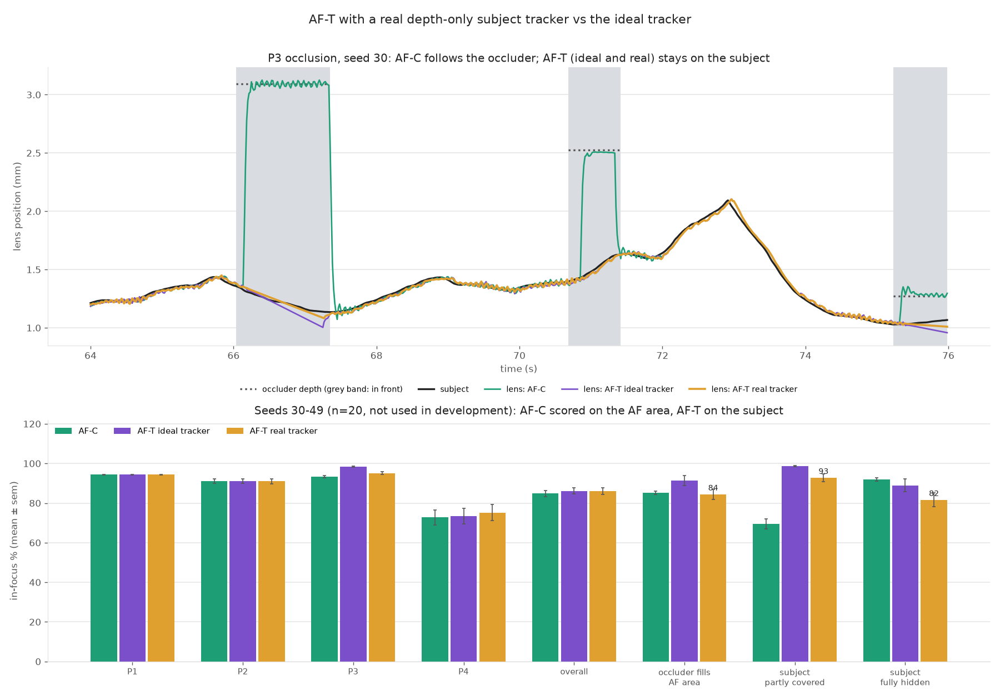

The tracker was developed on seeds 100–114. These numbers are from 20 seeds (30–49) not
looked at until the design was frozen (in-focus %, AF-T scored on the subject):

| | P1 | P2 | P3 | P4 | overall | occluder fills AF area | subject partly covered | subject fully hidden |
|---|---|---|---|---|---|---|---|---|
| AF-T, ideal tracker | 94.4 | 91.0 | 98.4 | 73.4 | 86.1 | 91.3 | 98.6 | 88.9 |
| **AF-T, real tracker** | 94.3 | 91.0 | 95.1 | **75.1** | **86.1** | **84.4** | **92.7** | **81.6** |
| real − ideal (sem) | −0.0 | −0.0 | −3.3 ± 0.8 | +1.7 ± 1.4 | +0.0 ± 0.7 | −6.9 ± 1.9 | −5.9 ± 1.9 | −7.3 ± 2.6 |

Overall it matches the ideal tracker. It gives up about 7 points while the subject is hidden
and wins them back in the harsh phase, where it drops rain-hit zones the ideal tracker keeps.
For comparison, AF-C (which correctly follows the occluder) is on the subject only 9–19% of
the time while the occluder fills the AF area (4-phase ablation). The remaining misses are honest limits of
depth-only tracking:
- an occluder within measurement noise of the subject's depth;
- a subject that changes direction while hidden;
- an occluder that covers the whole AF area within one frame (it looks like subject motion).

**The whole chain in C ([af_c/](af_c/README.md)).** The eyes (FFT phase correlation per zone),
the tracker and the brain are all ported to C99: no heap, fixed work per frame, ~200 µs per
frame on one x86-64 core (1.2% of a 60 fps frame), 7.1 KB of code on a Cortex-M4F.

- **Equivalence.** Every stage is tested against its Python reference on simulator data:
  - eyes: 16,730 zone estimates with 0 correlation-peak flips
  - tracker: 17,619 decisions, 0 different
  - brain: 3.6e-15 mm in double
- **Closed loop.** It runs inside the 4-phase simulator.
- **Standalone.** `af_c/af_demo` is a pure-C closed-loop demo with no Python:

```bash
cd af_c && make && ./af_demo && make check
```

## Four realism gaps, tested

The chain above still simplifies four things a real camera faces. Each was tested here; one
result is negative.

**1 + 2. A 2-D AF grid, and subject identity** (`scripts/run_2d_identity.py`)

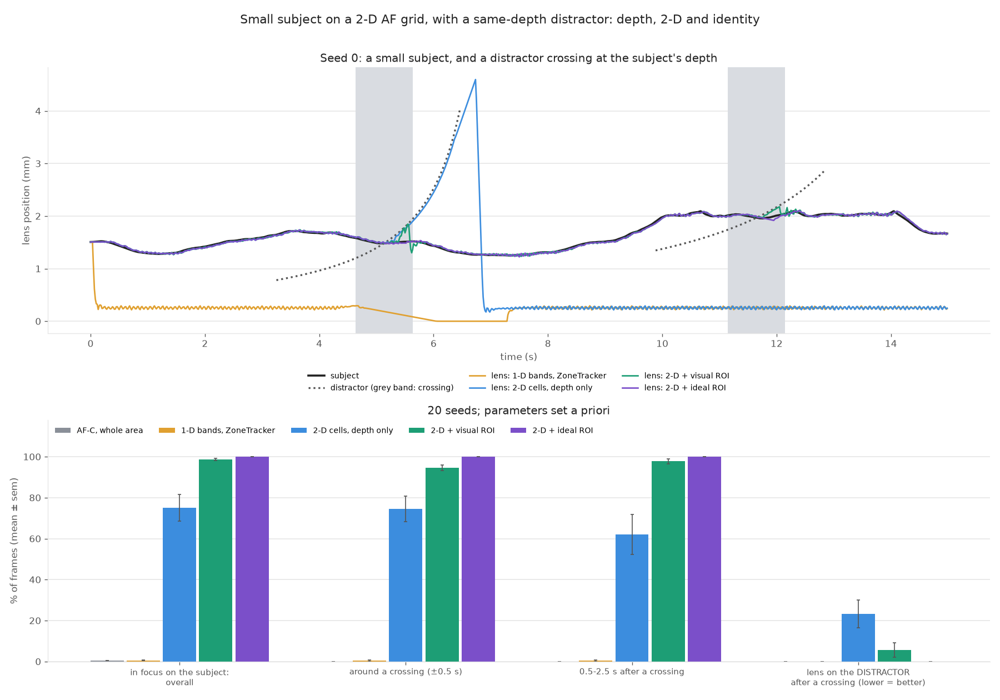

A small subject (1 × 2 cells of a 4 × 8 grid) wanders in 2-D and in depth in front of a far
background. Twice per clip, a distractor crosses it *at exactly its depth*. Results over 20
seeds:

| | in focus on the subject | 0.5–2.5 s after a crossing | lens on the distractor after a crossing |
|---|---|---|---|
| AF-C, whole area | 0.3% | 0.0% | 0.0% |
| 1-D bands + ZoneTracker | 0.5% | 0.3% | 0.0% |
| 2-D cells, depth only | 75.0% | 62.0% | 23.2% |
| **2-D + simulated visual ROI** | **98.7%** | **97.7%** | **5.6%** |
| 2-D + ideal ROI | 100% | 100% | 0% |

- **Full-width bands can't hold a small subject.** The subject is a minority of every band,
  so each band's correlation peak is the background's, and both whole-area AF-C and the 1-D
  tracker sit on the background. 2-D cells are the precondition for tracking anything small.
- **Depth alone can't tell two objects at the same depth apart.** After a crossing, the
  depth-only tracker's lens is on the distractor 23% of the time.
- **The simulated ROI is deliberately imperfect.** It updates at 30 Hz, arrives 3 frames
  late, misses 10% of detections and jitters another 10%. In 30% of crossings it switches
  identity onto the distractor, until half a second after the two separate.
- **Depth checks the ROI.** When the ROI's cells are at the wrong depth while the subject is
  still seen near its predicted position, the ROI is overruled. An ROI that keeps
  disagreeing for 6 frames, with no subject seen elsewhere, is accepted. That catches most
  identity switches: after a crossing the lens is on the distractor 5.6% of the time,
  against 23.2% for depth only.
- **The architecture this supports:** the visual tracker says *where* the subject is, and the
  PDAF depth engine says *whether that is still the subject* and carries it between
  detections. The ROI here is a generic simulated detector plus multi-object tracker,
  Python only for now.

**3. Contrast (CDAF) verification of new locks: a negative result** (`DualGated(cdaf_verify=True)`, off by default)

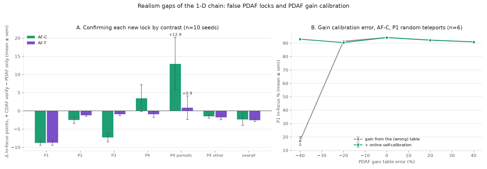

After every re-acquisition, the contrast is compared with the contrast held before the
jump. A drop below 60% of it starts a contrast hill-climb.
- On the harsh phase's periodic-texture frames it helps: AF-C +12.9 ± 7.3 points.
- Overall it costs more than it gains: AF-C −2.3 ± 1.7, AF-T −2.6 ± 0.4 (10 seeds). It
  checks contrast before the lens has finished long throws (P1 −8.8), and it compares
  different objects, such as an occluder's texture against the subject's (P3 −7.3).

The likely fix, not built yet: check only once the lens has arrived, and test for a local
contrast peak (probe ±δ) instead of comparing against a reference taken on another object.
Note that `X2DPlus.step()` receives the contrast score and ignores it, so every X2D+ result
in this repo is PDAF only.

**4. PDAF gain calibration** (`scripts/run_realism_gaps.py`, `pdaf_sim/calib.py`)

The gain K that converts disparity into defocus comes from a calibration table. On a real
body it varies with the lens, aperture, focus position and image height. P1 in-focus % with
the table deliberately wrong (AF-C, random teleports, 6 seeds):

| table error | −40% | −20% | 0 | +20% | +40% |
|---|---|---|---|---|---|
| table only | **17.1%** | 91.4% | 94.2% | 92.3% | 90.9% |
| + online self-calibration | **92.9%** | 90.4% | 94.1% | 92.2% | 90.9% |

- **The closed loop tolerates ±20%,** because every step re-measures.
- **An under-estimated gain is dangerous.** It over-drives every correction, and at −40% the
  loop breaks down.
- **Self-calibration rescues it** to 92.9%, with K within 1% of the true value. Elsewhere it
  stays within a point of the table. It uses the lens's own moves: with the subject still,
  moving the lens by ΔL changes the disparity by K·ΔL.
- **The estimate is still noisy** where few still-subject moves happen. By the end of the run
  it is 26% low to 19% high in some cases, which the loop survived here. It needs smoothing
  before production.

On the input side, `af_c` now also accepts per-zone disparity and confidence straight from a
hardware PDAF block (`af_chain_frame_zones`). That is how many sensors and ISPs deliver PDAF
results.

**Lens speed cap with the new chain** (`scripts/run_speed_cap_chain.py`, 20 seeds). Going from
4000 to 10000 steps/s adds +1.7 ± 0.5 points overall for AF-C and +1.5 ± 0.6 for AF-T. The
gain is in long throws:
- After a 3–9 mm jump, the median time to focus drops from 333 ms to 183 ms (p90 433 → 233 ms).
- AF-C switches onto a near occluder faster (median 133 → 108 ms, p90 367 → 192 ms).

## What's in this repo

- `pdaf_sim/psf.py` — circle-of-confusion radius, half-disk sub-aperture
  PSFs, signed disparity prediction
- `pdaf_sim/dualpixel.py` — synthesize left/right PDAF views from a sharp
  image, with optional sensor binning and reproducible noise
- `pdaf_sim/phase_corr.py` — 1-D phase correlation with sub-pixel
  refinement, PSR confidence, multi-zone agreement, CDAF score
- `pdaf_sim/policy.py` — Stateless / Temporal (Kalman) / V3
  (deadband + PID + CDAF fusion) / Behavioral (fittable) policies
- `pdaf_sim/policy_dual.py` — **DualGated**: calibrated-confidence, innovation-gated,
  two-timescale Kalman AF-C policy (Python reference model for `af_c/`)
- `pdaf_sim/zone_tracker.py` — **ZoneTracker**: depth-only AF-T subject tracker
  (subject / occluder zone association), plus per-zone estimates and the multi-zone combine
- `pdaf_sim/calib.py` — online self-calibration of the PDAF gain K from the lens's own moves
- `pdaf_sim/policy2d.py` — V4: 2-D zone grid + subject bounding-box
  Kalman tracker (subject persistence across occlusion)
- `pdaf_sim/sensor_imx461.py` — IMX461 geometry: 294-zone grid,
  native PDAF pitch, zone selection helpers
- `pdaf_sim/latency.py` — ISP pipeline-latency buffer
- `pdaf_sim/benchmarks.py` — standardized AF benchmarks with
  `REAL_ANCHORS` (direct observations of X2D 100C and Sony A7 IV)
- `scripts/run_imx461_stats.py` — **the headline experiment** (1000
  seeds, lever-by-lever, IMX461 geometry)
- `scripts/run_afc.py` — **the AF-C study**: moving-subject depth
  tracking, dropout grid, burst blackout, AF-loop-rate sweep
- `scripts/run_latency_sweep.py` — sensitivity of config D to
  uncompensated ISP latency
- `scripts/run_v4_tracking.py` — moving subject + occlusion demo
- `scripts/fit_policy.py` — behavioural-cloning fit of policy
  parameters to observed lens trajectories (differential evolution)

Extended AF-C algorithm studies (simulation-only — see `DISCLAIMER.md`):

- `scripts/run_big_levers.py` — **AF loop RATE × lens SPEED CAP sweep** with a
  servo magnetic voice-coil motor, speed caps at 4000/10000/12000/24000 steps/s.
  Loop rate dominates normal motion; speed cap only cuts big rack-focus settle
  time; the temporal filter is minor. Config is the big lever, not the algorithm.
- `scripts/run_realism_sweep.py` — pipeline **latency** + loop-rate vs a
  predictive filter: a non-predictive smoother lags under latency; prediction
  tuned to the latency recovers it.
- `scripts/run_adaptive_v2.py` — an **adaptive** policy (step-clamp +
  confidence-scaled prediction) in realistic units (subject distance in metres);
  high vs low contrast.
- `scripts/run_periodic.py` — **periodic-pattern aliasing**: phase detection can
  lock confidently on a *false* plane; a CDAF-coarse + PDAF-fine hybrid
  disambiguates where pure PDAF cannot.
- `scripts/run_focus_pull.py` — **timing a front→background pull** under
  latency / loop-rate / motor lag plus a foreground distractor; shows prediction
  overshoots on a sudden step (so it is motion-dependent).
- `scripts/run_lowcontrast_fix.py` — low contrast is **measurement-limited**:
  temporal integration recovers faint texture *without LiDAR*, while a truly
  textureless target is unfocusable by any passive method (physics).
- `scripts/run_x2d_plus.py` — **mixed / harsh-environment stress test (~2 min)**:
  brightness, motion, fog, and distortions (periodic / noise / dropout) randomly
  combined; improved policy vs baseline with a per-condition breakdown.
- `scripts/run_moving_dropout.py` — **core AF-C in normal conditions**: a brisk
  moving subject + ~1 s occlusions; firmware vs Kalman vs X2D+ (60 Hz + bias fix).
  The baseline loses the focus zone during occlusion; the proposal holds it.
- `scripts/run_stress_fps.py` — re-runs the harsh 2-min timeline at 30 Hz vs
  60 Hz: the loop rate lifts the harsh mix, and the predictive policy needs it.
- `scripts/run_ablation_4phase.py` — **incremental ablation** (+ loop rate +
  predictive + speed cap) plus an **AF-T** config, over a 4-phase timeline
  (random 0.6 m–∞ teleports / 1-2% contrast / occlusion / harsh mix + rain),
  realistic servo magnetic motor, 10 seeds. AF-C is scored on following what
  fills the AF area, AF-T on staying on the subject.
- `scripts/run_dual_gated.py` — **DualGated vs X2D+**: confidence calibration,
  P2 headroom (perfect-measurement and zero-latency bounds), and the paired
  comparison on 20 held-out seeds.
- `scripts/run_aft_tracker.py` — **AF-T with the real tracker vs the ideal one**,
  through a per-zone AF chain whose stages are swappable (Python or C).
- `scripts/run_2d_identity.py` — **2-D AF grid + subject identity**: small subject, same-depth
  distractor, depth-only vs simulated visual ROI vs ideal ROI.
- `scripts/run_realism_gaps.py` — **CDAF verification** (negative result) and **PDAF gain
  calibration** errors with online self-calibration.
- `scripts/run_speed_cap_chain.py` — lens speed cap 4000 vs 10000 steps/s with the current chain.
- `af_c/` — **the whole AF chain in C99** (eyes, tracker, brain, chain): no heap,
  a standalone C demo (`af_demo`), pure-C unit tests (`make check`), stage-by-stage
  equivalence tests against the Python references, a closed-loop check, a benchmark,
  and ARM Cortex-M4F / A53 code-size notes.
- `FINDINGS.md` — direct behavioural observations of the X2D 100C,
  organized by causal layer, cross-referenced with reviews and patents
- `DEV_LOG.md` — development log capturing intermediate hypotheses,
  failed configurations, and reasoning along the way
- `TECHNICAL_PROPOSAL.md` — the technical proposal this study supports,
  also intended for delivery as personal correspondence to Hasselblad

Earlier iterations (single-strip optics, superseded figures) are
preserved under `scripts/archive/` and `out/archive/` — the DEV_LOG
explains why each was superseded.

## Run

```bash
pip install -r requirements.txt
python scripts/run_imx461_stats.py     # headline figure (multi-core, ~2 min)
python scripts/run_afc.py              # AF-C study, all four figures (~1.5 min)
python scripts/run_latency_sweep.py    # latency sensitivity figure
python scripts/run_dual_gated.py       # DualGated vs X2D+ (~15 min; --quick ~3 min)
python scripts/run_aft_tracker.py      # AF-T real vs ideal tracker (~15 min; --quick ~3 min)
cd af_c && make && ./af_demo && make check   # the AF chain in C: demo + unit tests
python3 af_c/test_equiv.py             # every C stage vs its Python reference
python scripts/run_2d_identity.py      # 2-D grid + identity (~5 min)
python scripts/run_realism_gaps.py     # CDAF verification + gain calibration (~11 min)
```

## Case study constants

X2D-100C-class: Sony IMX461 (43.8 × 32.9 mm, 11656 × 8750, 3.76 µm),
294 PDAF zones, XCD 2,5/55V at f/2.5, 1.5 m subject. Swap the
constants in `pdaf_sim/sensor_imx461.py` to model another body.

## Real-camera anchors

The simulation is anchored against direct observations of:

- Hasselblad X2D 100C (firmware 4.2.0) with XCD 2,5/55V
- Sony A7 IV with 50mm f/1.8

Observed hunt times, failure indicators and behaviour signatures live
in `pdaf_sim/benchmarks.py::REAL_ANCHORS` and `FINDINGS.md`. The
baseline's stochastic same-scene behaviour in simulation independently
reproduces the stochastic lock-vs-hunt behaviour observed on the real
X2D — the one place where the synthetic model and the physical camera
cross-validate.

## What this is NOT

- Not a claim about Hasselblad's internal firmware implementation.
  Decision policies are generic and based on public PDAF literature;
  X2D constants are used only to make disparity magnitudes realistic.
  The firmware is closed: observed behaviour is consistent both with
  these techniques being absent and with them being present but
  limited elsewhere.
- Not a reverse-engineered firmware patch. The X2D firmware is signed
  and is not modified here. This is a behavioural / decision-policy
  study built entirely from public information and direct external
  observation.
- Not a deep-learning method. A linear Kalman prior is the minimum
  thing that should outperform a stateless threshold; if it does,
  more sophisticated approaches become worth exploring.

## Citations and further reading

- USPTO 9910247 — Focus hunting prevention for phase detection autofocus
- USPTO 9729779 — Phase detection autofocus noise reduction
- USPTO 11523071 — Disparity-preserving binning for phase detection
  autofocus (evidence that naive binning destroys PDAF phase signal)
- *Improving the Reliability of Phase Detection Autofocus* (IS&T)
- Sony Semiconductor IMX461 product flyer (binning modes documented
  for moving-picture output; PDAF-in-binned-mode behaviour not public)
- Capture Integration — *Fujifilm GFX 100S II — Profoundly Better
  Autofocus* (algorithmic-only PDAF improvement across two generations
  with shared hardware)

Related work for DualGated (confidence-weighted PDAF filtering and
predictive AF are established practice):

- USPTO 10044926 — Optimized phase detection autofocus (PDAF) processing
  (confidence-thresholded use of PDAF depth)
- USPTO 11985421 — Device and method for predicted autofocus on an object
  (Kalman-filter prediction for moving subjects)
- KR 20160143803 A — Reliability measurements for phase based autofocus
- libcamera, Raspberry Pi AF algorithm (`src/ipa/rpi/controller/rpi/af.cpp`):
  open-source PDAF + CDAF autofocus for the IMX708 Camera Module 3, with
  PDAF confidence thresholds (`conf_thresh`, `conf_epsilon`)
- H. A. P. Blom and Y. Bar-Shalom, *The interacting multiple model
  algorithm for systems with Markovian switching coefficients*, IEEE TAC,
  1988 (the IMM variant tried before the two-timescale handover)

## License

MIT.

## Acknowledgements

Built in conversation with Claude (Anthropic) as a thinking partner,
in the spirit of "a smart colleague who walks into the room." Final
technical claims and observations are the author's responsibility.

## Disclaimer

Personal research / independent investigation only. **Simulation code only — no
firmware, no `.cim` files, no decrypted or extracted firmware data** is included
or required. This is an idealised model of autofocus *algorithms*, not a
reverse-engineering of any product's implementation. Not affiliated with or
endorsed by Hasselblad / DJI / any manufacturer. Provided "as is", without
warranty. See [DISCLAIMER.md](DISCLAIMER.md) for the full text.
